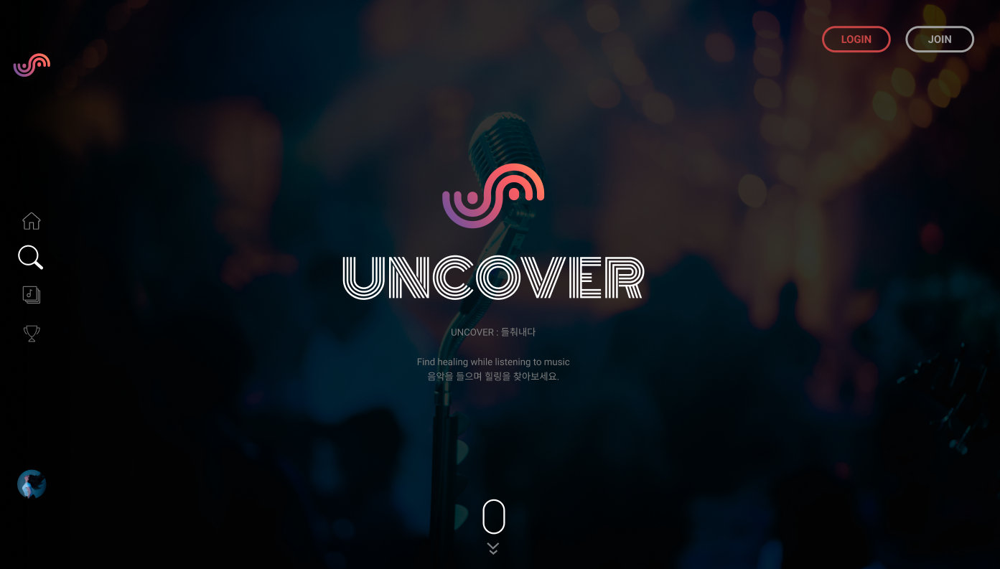
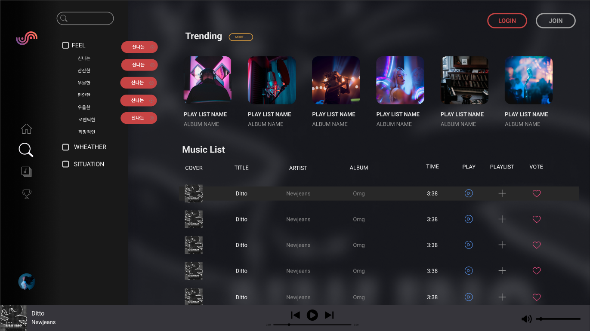
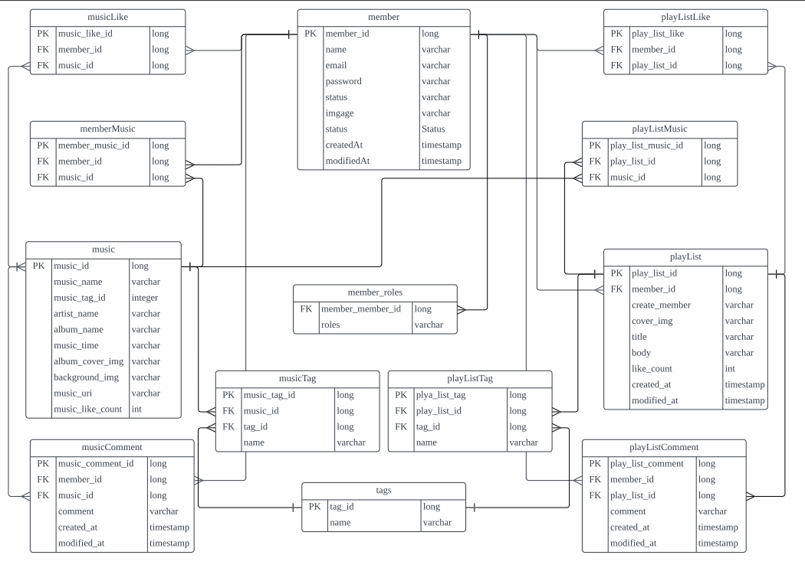

## Team. Undefined
### [UNCOVER](http://mainproject-uncover.s3-website.ap-northeast-2.amazonaws.com)
.png)

## Team List
|||||||
|:---:|:---:|:---:|:---:|:---:|:---:|
|[홍혜란](https://github.com/forhrever)|[김주비](https://github.com/mscojl24)|[박수범](https://github.com/parksubeom)|[김인환](https://github.com/Preasim)|[이재관](https://github.com/CordJG)|[강지산](https://github.com/hunm719)|
|FE 팀장|FE|FE|BE 팀장|BE|BE|
|- Musiclist page (Trending, musiclist)   - Musiclist like (CRUD)   - Mypage 회원정보   - Mypage like list   - Mypage Myplaylist (CRUD)   - Mypage ModifyPlaylist (RUD) |- 전반적 반응형 css 및 Animation 동작구현  - Main page (fullpage-scroll)  - Playlist page (slider/tap-menu)  
- Navigate component  - MusicDetail page  - MusicDetail comment (CRUD)  - Sound component (+playlist-viewer)  - Mypage 회원탈퇴  - All Pagination 구현  - Music Download   | -로컬 Signin/Signup   -유저정보 관리   -Oauth 네이버    -Oauth 카카오    -Oauth 구글   -믹싱페이지(Fitting Room)   - 플레이리스트 음악 추가 | |-Member CRUD   -Security   -JWT   -local 로그인,로그아웃 구현   -OAuth2 구글,네이버,카카오 구현   -AWS deployment   -s3 버킷 이미지 연동(프로필 이미지)   -Tag CRUD   -개인 Member 맞춤 음악 추천 기능 | -music CRUD 및 좋아요 댓글 구현   -키워드 검색 및 태그 검색 기능 구현   -AWS deployment |

 

## Stacks

 

## Service info

**No Copyright Music 서비스 플랫폼 입니다.**  
프로젝트 기간: 2023.04.28 ~ 2023.05.31

## [API 명세서](https://documenter.getpostman.com/view/25524075/2s93eX1DP8#de8c1b63-20c9-40cf-ad48-514269974fb3)

## ERD

ERD

## 프로젝트 설명

 
프로젝트 아키텍처 및 개발 툴

 
### Project Architecture

### Deploy Tools

  
 

 
   
     
     

